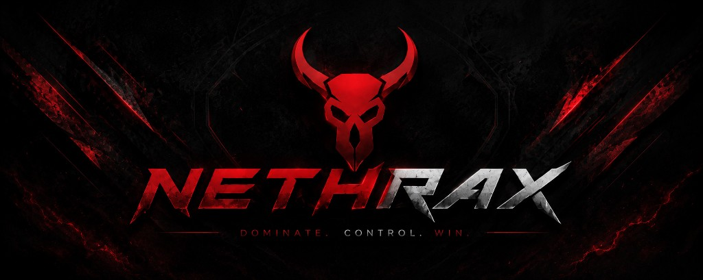

# Nethrax — CS2 Webradar

**Private slotted Counter-Strike 2 webradar.** Real-time CS2 webradar map intel in your browser. Limited seats. HWID-bound access.

> **Access is Discord-only.** No public downloads. No public keys. Join the community to claim a slot.

## Get access

1. Join the Discord: **[https://discord.gg/df4FYdskTZ](https://discord.gg/df4FYdskTZ)**
2. Accept the rules
3. Check `#how-to-buy` for open slots
4. Follow `#setup-guide` after purchase

Slots are limited. When capacity is full, enrollment closes until a seat opens.

## Why Nethrax

- **Slotted community** — fixed member capacity, not mass distribution
- **HWID-bound seats** — one player, one machine
- **CS2 webradar in the browser** — live map intel without a cluttered overlay stack
- **Private support** — billing, HWID, and setup handled in tickets
- **Controlled updates** — loader + webradar platform delivered to members only

## Features

### Webradar

- Live player positions on the map
- Team / enemy context
- Distance and map awareness
- Browser-based CS2 webradar view (desktop)

### Access control

- Discord-linked accounts
- Subscription plans
- Device binding (HWID)
- Slot capacity limits

### Community

- Status & detection updates
- Setup guides
- Private member support
- Changelog / announcements

## Preview

## How it works

1. Open Discord and claim membership when slots are available
2. Complete checkout through the official buy flow
3. Link your account and authorize your device
4. Launch via the member loader and open the CS2 webradar

**There is no public source code in this repository.** Distribution happens only through the official Nethrax Discord.

## Keywords

CS2 webradar · Counter-Strike 2 web radar · private slotted webradar · HWID-bound CS2 radar

## Status

| Item | Detail |
|------|--------|
| Product | CS2 webradar |
| Model | Private / slotted / HWID-bound |
| Entry | Discord only |
| Pricing | From member plans in `#how-to-buy` |
<!-- status:start -->
| Last verified | 2026-07-28 15:14 UTC |
<!-- status:end -->

## Support

All support runs inside Discord:

- Setup → `#setup-guide`
- Buy / slots → `#how-to-buy`
- Help → tickets / `#support`

**Discord:** [https://discord.gg/df4FYdskTZ](https://discord.gg/df4FYdskTZ)

## Disclaimer

Nethrax is a private membership platform. You are responsible for how you use the software and for complying with game and platform terms that apply to you. Misuse, sharing, reselling, or leaking access results in a permanent ban.

## License

This repository is advertising / documentation only and contains no product source. See [LICENSE](LICENSE).
